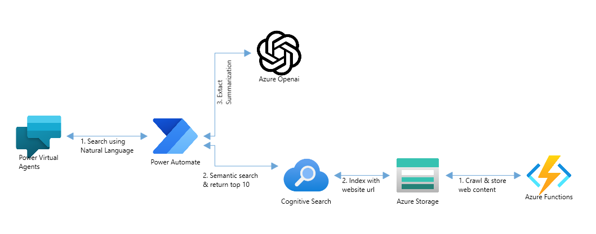

# Semantic Search Using OpenAI & Bots

## PreRequisites
- [Azure OpenAI](https://learn.microsoft.com/en-us/azure/cognitive-services/openai/quickstart?pivots=programming-language-studio)
  - If you don't have one, you can request access [here](https://aka.ms/oai/access)
- [Azure Cognitive Search](https://learn.microsoft.com/en-us/azure/search/knowledge-store-create-portal) with [Semantic Search](https://learn.microsoft.com/en-us/azure/search/semantic-search-overview) Enabled
- Power Platform License
- Power Virtual Agent License

### Constraints
- The OpenAI API is currently in preview, available only in Azure Commercial, and is subject to change

## Architecture


## Flow

1. The web crawler crawls a website, extracts the contents and puts them in a blob storage
2. Cognitive search indexes the contents with semantic search enabled
3. The user asks the bot a question
4. The bot with Power Automate queries Cognitive search, gets the top 10 semantic search results
5. Power Automate then passes the results to OpenAI to extract summarization from the top search results and returns the text to be displayed to the user along with links to the source where the factual information could be found

## Details

### Web Crawler
This is a C# console application that crawls a website,extracts contents and put them in a blob stroage with the url of the site in the custom metadata property `fileSource`. The run time for this will depend on the size and complexity of the site being crawled.

#### AppSettings
- `StorageConnectionString` - the connecting string for the blob storage
- `ContainerName` - the name of the container in the blob storage

### Cognitive Search
This is a standard cognitive search with semantic search enabled. The index is created against the blob storage with the above `fileSource` as one of the index fields.
The `fileSource` index field is set as a `Searchable` field and `Retrievable` . The `content` index field is set as a `Searchable`  and `Retrievable` field.

### PowerApp Solution
This solution consists of a bot and a Power Automate flow. Following environment variables needs to be set

#### Steps to import the solution
1. Download and extract the Power App Solution Zip file
2. Follow this [link](https://learn.microsoft.com/en-us/power-apps/maker/data-platform/import-update-export-solutions) to import the solution

#### Environment Variables

- `CognitiveSearch_APIKEY` - The API key for the cognitive search
- `CognitiveSearch_Semantic_Url` - The endpoint url for the Cognitive Search along with version.
  ```
  https://{COGNITIVE SEARCH ENDPOINT URL}/indexes/{{COG SEARCH INDEX NAME}}/docs/search?api-version=2021-04-30-Preview
  ```
- `OpenAI_Commercial_APIKEY` - Azure OpenAI API Key
- `OpenAIWebSiteSearch_URL` - The Azure OpenAI endpoint Url for the textdavinci003 model deployment

## References
- [Azure Search with OpenAI](https://github.com/Azure-Samples/azure-search-openai-demo)