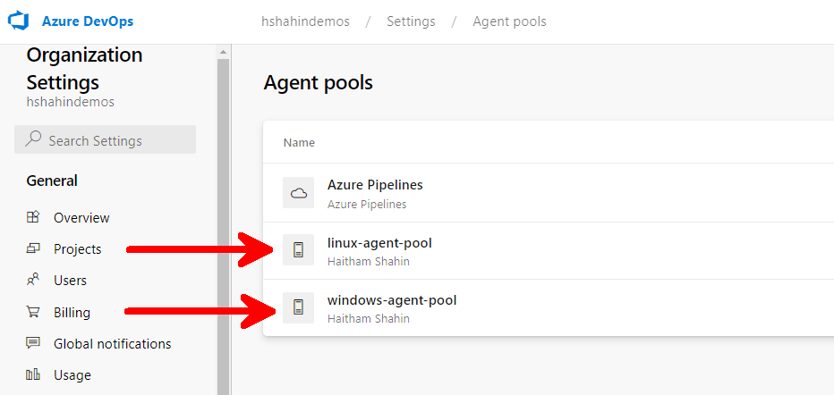
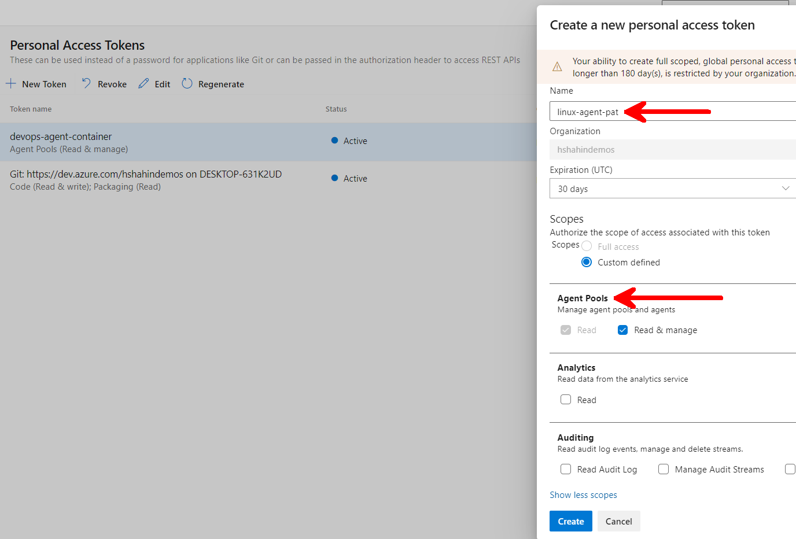
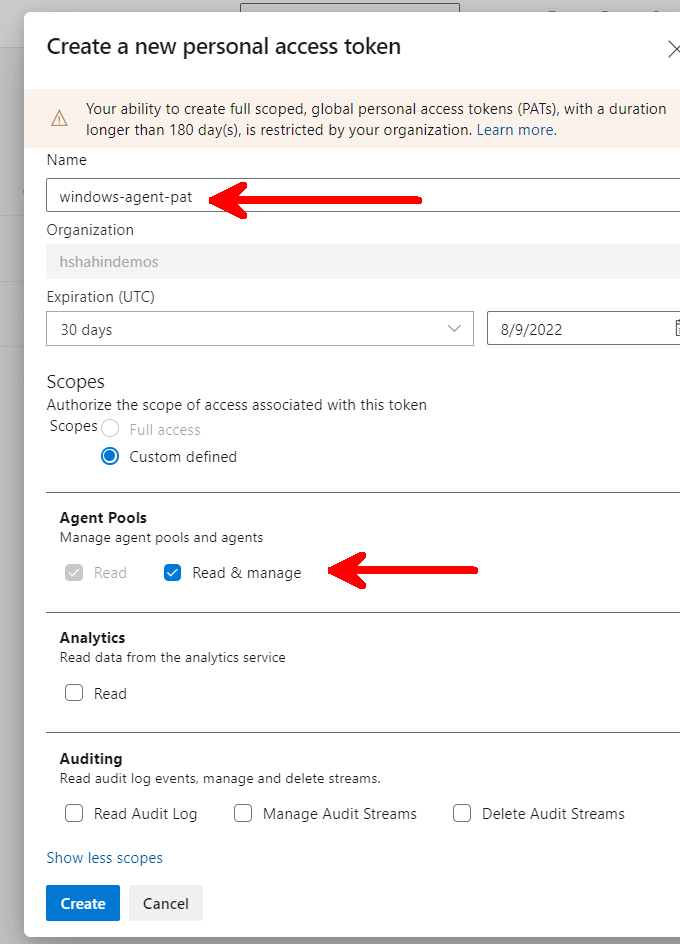
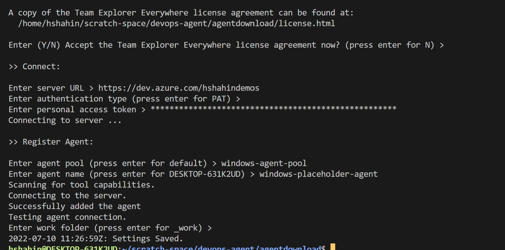

# Run Containerized Azure DevOps Agents that Dynamically Scale with AKS & KEDA

For those using Azure DevOps Server or Services (Cloud-Hosted), a great way to optimize resource utilization and make your agents dynamic/ephemeral is to [containerize your pipeline agents](https://docs.microsoft.com/en-us/azure/devops/pipelines/agents/docker?view=azure-devops) as opposed to running them as long-lived VMs. [VM Scale Set Agents](https://docs.microsoft.com/en-us/azure/devops/pipelines/agents/scale-set-agents?view=azure-devops) also are not supported on Server, so we wanted to bring an approach that brings that scalability and dynamic scaling for parallel/queued jobs even to those running Azure DevOps Server.

View the following video to see the demo live and to understand what this solution provides. The following instructions will allow you to deploy both Windows and Linux Agents on an AKS Cluster that has both Linux and Windows node pools.

> The video shows the concept for Linux Agents. This works the same way for Windows Agents and the following solution will deploy both. You can choose to deploy just one or the other if desired.

[](http://www.youtube.com/watch?v=06RF-I87jMs "Scaling Containerized Azure DevOps Agents with AKS + KEDA")

## 1. Run Bicep Deployment to Deploy AKS & ACR

Take note that the location option below is not to configure the location of your deployed resources, it is for the storage of the deployment resource associated with the subscription

```bash
export LOCATION=<LOCATION>

az deployment sub create \
    --location $LOCATION \
    --template-file bicep/main.bicep \
    --parameters bicep/main.parameters.json
```

### Additional Notes

This cluster is created with 3 node pools - a system node pool which will run system components (coredns, metric server, etc.), a linux node pool to be scheduled for linux agents, and a windows node pool for windows agents.

We want to be sure that we schedule linux agents only to the linux node pool and windows agents to the windows node pool. To do this, the Bicep deployment creates the two node pools with [node taints](https://kubernetes.io/docs/concepts/scheduling-eviction/taint-and-toleration/) so that a windows node can repel a set of pods not explicitely tolerating a windows node. Furthermore, to ensure that a pod itself is scheduled on the right nodes, the node label of `kubernetes.io/os` is used, which is automatically populated by the kubelet.


## 2. Build the Agent Images using ACR Tasks

Find the ACR Name by running `az acr list -g <RESOURCE-GROUP-NAME-o table`

```bash
export RG_NAME=<RESOURCE-GROUP-NAME>
export ACR_NAME=<ACR-NAME>

az acr build \
    --registry $ACR_NAME \
    -g $RG_NAME \
    --image linux-agent:latest \
    dockeragent/linux/.

az acr build \
    --registry $ACR_NAME \
    -g $RG_NAME \
    --image windows-agent:latest \
    --platform windows \
    dockeragent/windows/.
```

## 3. Create Two Agent Pools in Azure DevOps with Placeholder Agents

First [create two new self-hosted agent pools](https://docs.microsoft.com/en-us/azure/devops/pipelines/agents/pools-queues?view=azure-devops&tabs=yaml%2Cbrowser#default-agent-pools). You will need one for the linux agents and another for the windows agents:



Next [create PAT tokens](https://docs.microsoft.com/en-us/azure/devops/organizations/accounts/use-personal-access-tokens-to-authenticate?view=azure-devops&tabs=Windows) for agent authentication:





Finally, in order to enable KEDA to scale all the way down to zero for agents, it will be necessary to create a "placeholder" agent that is disabled/non-running.

Navigate to the linux agent pool and click New Agent. You can then download the agent tar file locally so that you can run the placeholder. Follow the steps to download the agent and only run the configure step, you will not actually run the agent itself:

```bash
# Copy download link on the agent page to get latest download version
mkdir agentdownload && cd agentdownload
wget https://vstsagentpackage.azureedge.net/agent/2.204.0/vsts-agent-linux-x64-2.204.0.tar.gz
tar zxvf vsts-agent-linux-x64-2.204.0.tar.gz

# Fill in the prompts accordingly for linux agent pool
# Example of config is shown below
./config.sh

# Remove the download after the config runs
cd ..
rm -rf ./agentdownload
```


Navigate to the windows agent pool and go through the same steps. Technically the download is the same, but for a mental model and organization it helps to differentiate and see outputs accordingly:

```bash
# Copy download link on the agent page to get latest download version
mkdir agentdownload && cd agentdownload
wget https://vstsagentpackage.azureedge.net/agent/2.204.0/vsts-agent-linux-x64-2.204.0.tar.gz
tar zxvf vsts-agent-linux-x64-2.204.0.tar.gz

# Fill in the prompts accordingly for windows agent pool
./config.sh

# Remove the download after the config runs
cd ..
rm -rf ./agentdownload
```




## 4. Deploy the Helm Chart to AKS to setup KEDA Scaling

First you should go to `helm/values.yaml` and make a copy of the file named `values-local.yaml`:

```bash
cp helm/values.yaml helm/values-local.yaml
```

From there, fill in the values per the comments in values-local.yaml. Here's an example of what a finished `values-local.yaml` should look like (the values provided here are representative of what might be your own once you customize):

```yaml
# Default values for linuxAgentChart.
# This is a YAML-formatted file.
# Declare variables to be passed into your templates.
namespace: devops

linux:

  image:
    acrLoginServer: acrwtytxpq2mm.azurecr.io
    name: linux-agent
    tag: latest

  secret:
    # THIS IS A CREDENTIAL - BE SURE NOT TO COMMIT TO REPO
    azpToken: 7zk11rjq2xkm6prhghaf6dpn2o44wn52yrjqxqt5q5lvfa2xc62a
    azpUrl: https://dev.azure.com/myorg

  job:
    poolName: linux-agent-pool
    runOnce: "True"

  trigger:
    poolId: 11
    targetPipelinesQueueLength: 1


windows:

  image:
    acrLoginServer: acrwtytxpq2mm.azurecr.io
    name: windows-agent
    tag: latest

  secret:
    # THIS IS A CREDENTIAL - BE SURE NOT TO COMMIT TO REPO
    azpToken: 8zk11rjq2xkm6prhghaf6dpn2o44wn52yrjqxqt5q5lvfa2xc62a
    azpUrl: https://dev.azure.com/myorg

  job:
    poolName: windows-agent-pool
    runOnce: "True"

  trigger:
    poolId: 12
    targetPipelinesQueueLength: 1
```

Once you have the `values-local.yaml` filled out, run the commands below to apply the template. You'll first need to connect to your AKS Cluster as shown below:

```bash
# Connect to AKS Cluster
export AKS_NAME=<AKS-CLUSTER-NAME>
az aks get-credentials -g $RG_NAME -n $AKS_NAME

# As a check, confirm you see the windows and linux nodes
# You should also see the system nodes
kubectl get nodes

# Apply templates
helm template devops helm/. -f helm/values-local.yaml | kubectl apply -f -
```

## 5. Run Pipelines and See the Agents Scale

Now that you have the Scaled Jobs defined in your AKS Cluster, create Azure Pipelines that reference the self-hosted agent pools and you should now see the pods scale in and out as the queue add pipeline runs.

Here is an example starter pipeline that does a simple echo. Define two different pipelines and reference the different pools to have them scheduled either on the linux or windows agents:

```yaml
# Starter pipeline
# Start with a minimal pipeline that you can customize to build and deploy your code.
# Add steps that build, run tests, deploy, and more:
# https://aka.ms/yaml
trigger:
- main

pool: # linux-agent-pool | windows-agent-pool

steps:
- script: echo Hello, world!
  displayName: 'Run a one-line script'

- script: |
    echo Add other tasks to build, test, and deploy your project.
    echo See https://aka.ms/yaml
  displayName: 'Run a multi-line script'
```

Once you run the pipelines, you should see the jobs start as the queue builds. View the recording included to see how this works and how you can view that action taking place.

## References

- [Container Agent Repo by @georgdrobny](https://github.com/georgdrobny/ContainerAgent)

- [Windows Base Image](https://github.com/microsoft/dotnet-framework-docker/blob/a853e05e409b3009b059fa3945837765c9bc43b8/src/sdk/4.8/windowsservercore-ltsc2022/Dockerfile)